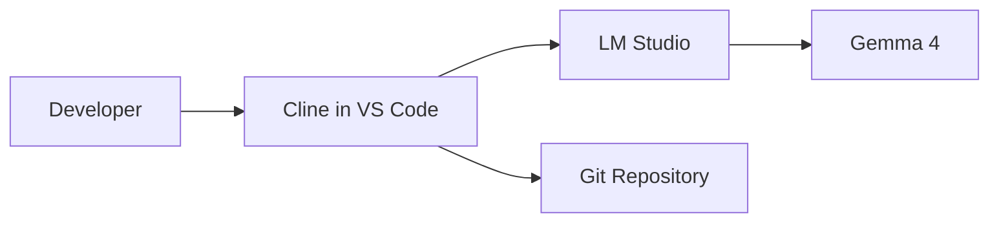
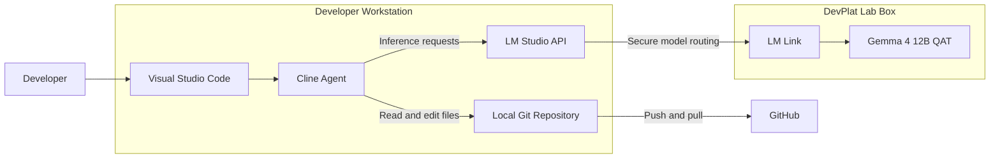
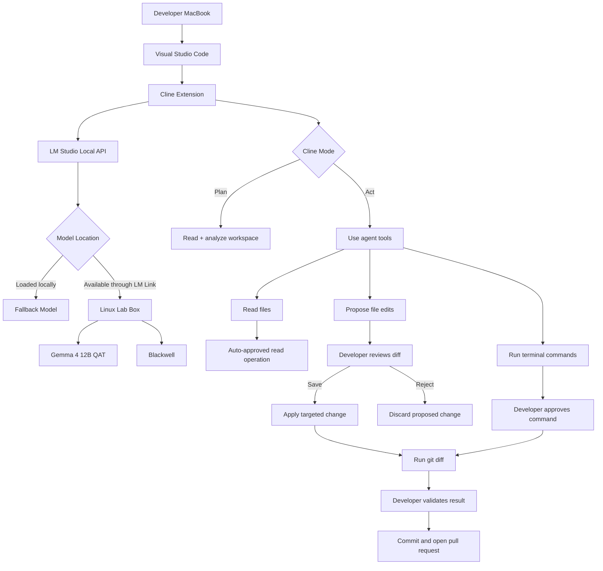
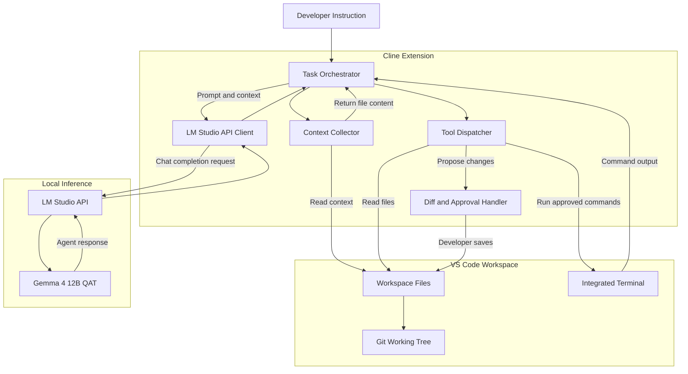

... see more in the design overview [readme.md](https://github.com/vinas1/vibecode/blob/main/README.md)

| Architectural L1 Context Diagram |
| :---: |

---

| Architectural L2 Container Diagram |
| :---: |

---

| Architectural L3 Component Diagram |
| :---: |

---

| Architectural L4 Component Diagram |
| :---: |

Deep dive and code is available in the [design overview](https://github.com/vinas1/vibecode/blob/main/README.md).
